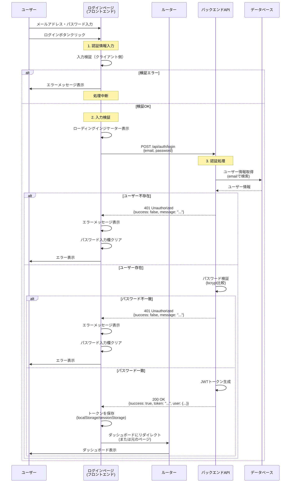

# 10_10_01_act01: 認証情報入力・検証・認証処理 シーケンス図

## アクション情報

| 項目 | 内容 |
|------|------|
| アクションID | `10_10_01_act01` |
| アクション名 | 認証情報入力・検証・認証処理 |
| 画面ID | `10_10_01`（ログインページ） |
| トリガー | ログインボタンクリック |

## シーケンス図

## 処理フロー詳細

### 1. 認証情報入力
- ユーザーがメールアドレスとパスワードを入力
- ログインボタンをクリック

### 2. 入力検証（クライアント側）
- メールアドレスの形式チェック
- パスワードの最小文字数チェック
- 検証エラーがある場合、エラーメッセージを表示して処理を中断

### 3. 認証処理（サーバー側）
- APIリクエスト送信: `POST /api/auth/login`
- データベースでユーザー情報を取得
- パスワードを検証（bcrypt比較）
- 認証成功時、JWTトークンを生成して返却

### 4. レスポンス処理
- **成功時**: トークンを保存し、ダッシュボードにリダイレクト
- **失敗時**: エラーメッセージを表示し、ログインページに留まる

## エラーハンドリング

| エラー種別 | HTTPステータス | 処理 |
|-----------|--------------|------|
| 認証失敗（ユーザー不存在/パスワード不一致） | 401 Unauthorized | エラーメッセージ表示、パスワード入力欄クリア |
| ネットワークエラー | - | 「通信エラーが発生しました。再度お試しください」を表示 |
| サーバーエラー | 500 Internal Server Error | 「システムエラーが発生しました。しばらくしてから再度お試しください」を表示 |

## 備考

- パスワードは平文で送信されるが、HTTPS通信を使用する（本番環境）
- エラーメッセージは、セキュリティのため、ユーザー存在の有無を推測できないようにする
- ローディングインジケーターは、APIリクエスト送信中に表示

