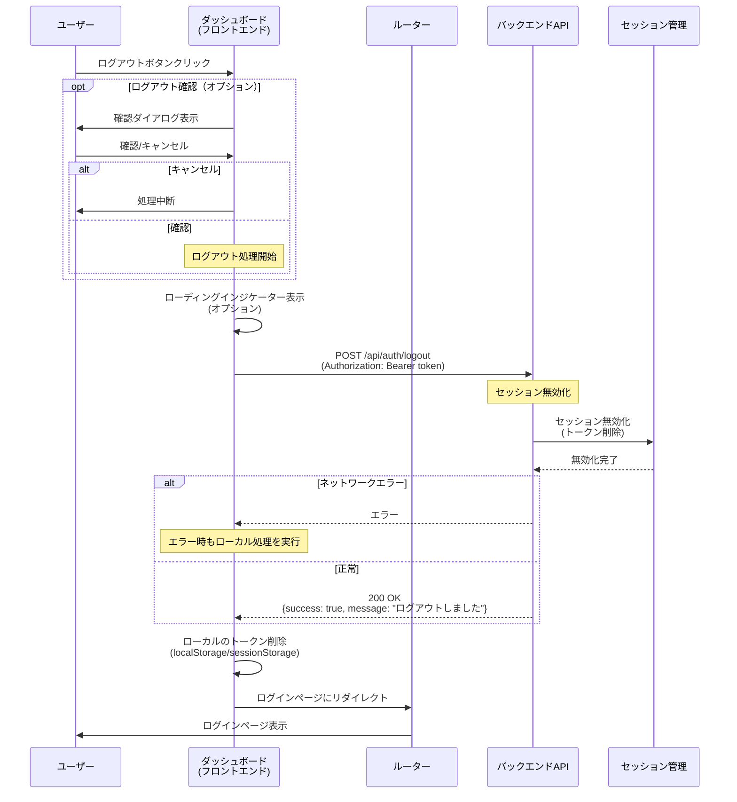

# 10_10_02_act01: ログアウト シーケンス図

## アクション情報

| 項目 | 内容 |
|------|------|
| アクションID | `10_10_02_act01` |
| アクション名 | ログアウト |
| 画面ID | `10_10_02`（ダッシュボード） |
| トリガー | ログアウトボタンクリック |

## シーケンス図

## 処理フロー詳細

### 1. ログアウト確認（オプション）
- 確認ダイアログを表示（実装による）
- キャンセルした場合、処理を中断

### 2. APIリクエスト送信
- `POST /api/auth/logout`
- 認証トークンをヘッダーに含める
- ローディングインジケーターを表示（オプション）

### 3. セッション無効化（サーバー側）
- サーバー側でセッションを無効化
- トークンを削除

### 4. クライアント側処理
- ローカルの認証トークンを削除
- ログインページにリダイレクト

## エラーハンドリング

| エラー種別 | 処理 |
|-----------|------|
| ネットワークエラー | エラーメッセージを表示し、ローカルのトークンを削除してログインページにリダイレクト |
| サーバーエラー | 同様に処理（ローカルのトークンを削除してログインページにリダイレクト） |

## 備考

- エラーが発生した場合でも、ローカルのトークンは削除する
- これにより、クライアント側の認証状態を確実にクリアできる
- ログアウト確認ダイアログは、実装によっては省略可能

