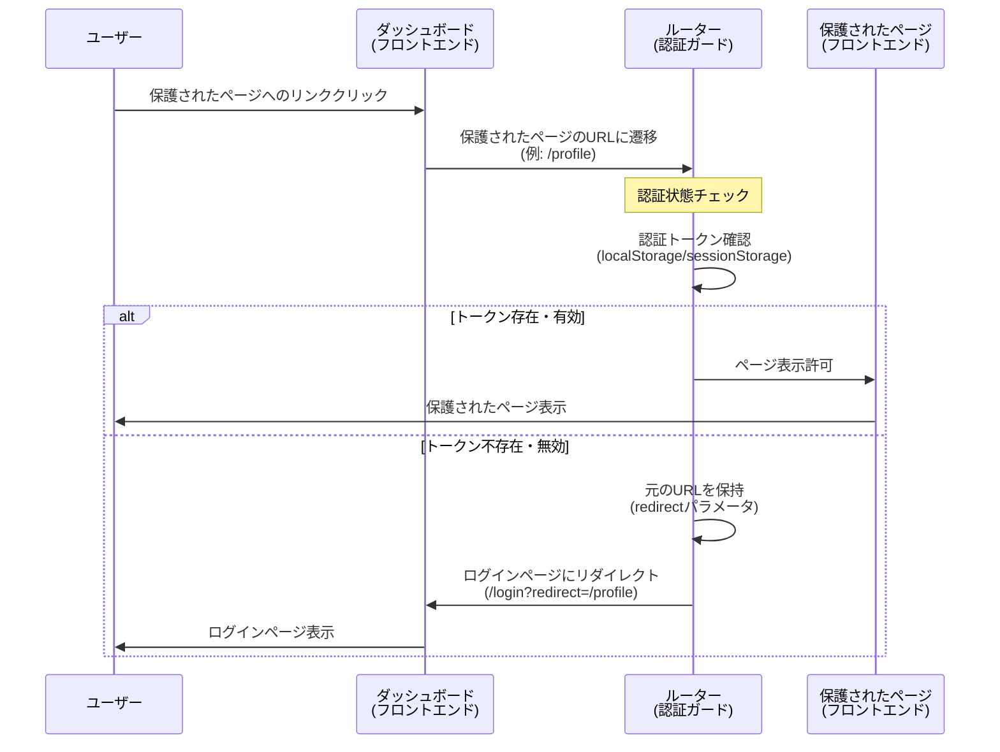

# 10_10_02_act02: 保護されたページへの遷移 シーケンス図

## アクション情報

| 項目 | 内容 |
|------|------|
| アクションID | `10_10_02_act02` |
| アクション名 | 保護されたページへの遷移 |
| 画面ID | `10_10_02`（ダッシュボード） |
| トリガー | リンククリック、メニュー選択など |

## シーケンス図

## 処理フロー詳細

### 1. リンククリック
- ユーザーが保護されたページへのリンクをクリック
- または、メニューから保護されたページを選択

### 2. ルーター側の認証状態チェック
- ルーター（認証ガード）が認証状態をチェック
- 認証トークンまたはセッションの有効性を確認

### 3. 分岐処理
- **ログイン済み**: 保護されたページを表示
- **未ログイン**: ログインページにリダイレクト（元のURLを保持）

## リダイレクト処理

### URLパラメータの保持
- 未ログインの場合、元のURLを`redirect`パラメータとして保持
- 例: `/login?redirect=/profile`
- ログイン成功後、元のページ（`/profile`）にリダイレクト

## 備考

- 認証状態チェックは、ルーター側で自動的に実行される
- 認証ガード（AuthGuard）を使用して実装
- トークンの有効性は、必要に応じてサーバー側でも確認可能

