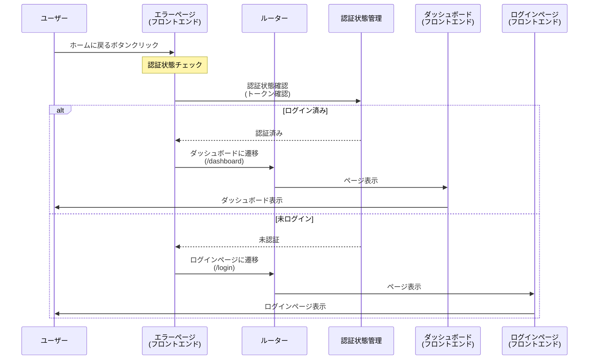

# 10_10_04_act01: ホームに戻る シーケンス図

## アクション情報

| 項目 | 内容 |
|------|------|
| アクションID | `10_10_04_act01` |
| アクション名 | ホームに戻る |
| 画面ID | `10_10_04`（エラーページ） |
| トリガー | ホームに戻るボタンクリック |

## シーケンス図

## 処理フロー詳細

### 1. ホームに戻るボタンクリック
- ユーザーがエラーページの「ホームに戻る」ボタンをクリック

### 2. 認証状態チェック
- 認証状態管理から認証状態を確認
- 認証トークンまたはセッションの有効性を確認

### 3. 分岐処理
- **ログイン済み**: ダッシュボード（`10_10_02`）に遷移
- **未ログイン**: ログインページ（`10_10_01`）に遷移

## 遷移先

| 認証状態 | 遷移先画面 | URL |
|---------|-----------|-----|
| ログイン済み | ダッシュボード | `/dashboard` または `/` |
| 未ログイン | ログインページ | `/login` |

## 備考

- エラーページから安全にホームに戻るためのアクション
- 認証状態に応じて適切なページに遷移
- エラーが発生した後でも、ユーザーがアプリケーションを継続して使用できるようにする

