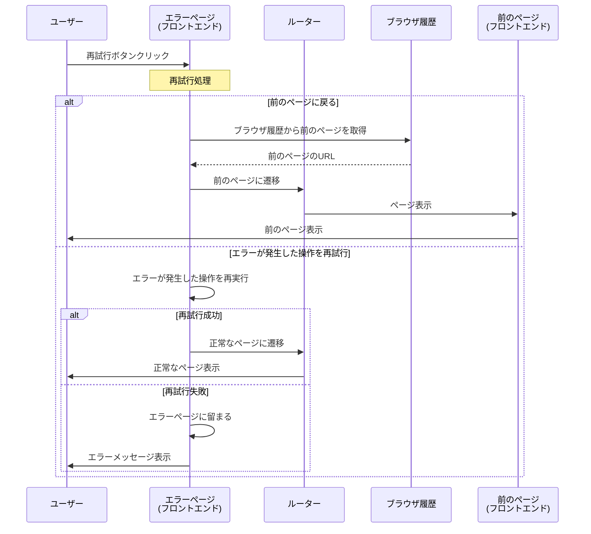

# 10_10_04_act02: 再試行 シーケンス図

## アクション情報

| 項目 | 内容 |
|------|------|
| アクションID | `10_10_04_act02` |
| アクション名 | 再試行 |
| 画面ID | `10_10_04`（エラーページ） |
| トリガー | 再試行ボタンクリック |

## シーケンス図

## 処理フロー詳細

### 1. 再試行ボタンクリック
- ユーザーがエラーページの「再試行」ボタンをクリック

### 2. 再試行処理
- **パターン1**: 前のページに戻る
  - ブラウザ履歴から前のページのURLを取得
  - 前のページに遷移
- **パターン2**: エラーが発生した操作を再試行
  - エラーが発生した操作（APIリクエストなど）を再実行
  - 成功した場合、正常なページに遷移
  - 失敗した場合、エラーページに留まる

### 3. 結果処理
- **成功**: 正常なページに遷移
- **失敗**: エラーページに留まり、エラーメッセージを表示

## 再試行の種類

| 再試行タイプ | 説明 | 適用場面 |
|------------|------|---------|
| 前のページに戻る | ブラウザ履歴を使用して前のページに戻る | ナビゲーションエラーなど |
| 操作を再試行 | エラーが発生した操作を再実行 | APIリクエストエラーなど |

## 備考

- 再試行ボタンは、一時的なエラーの場合に特に有効
- エラーが解消されない場合、エラーページに留まる
- 再試行回数に制限を設けることも検討（無限ループ防止）

